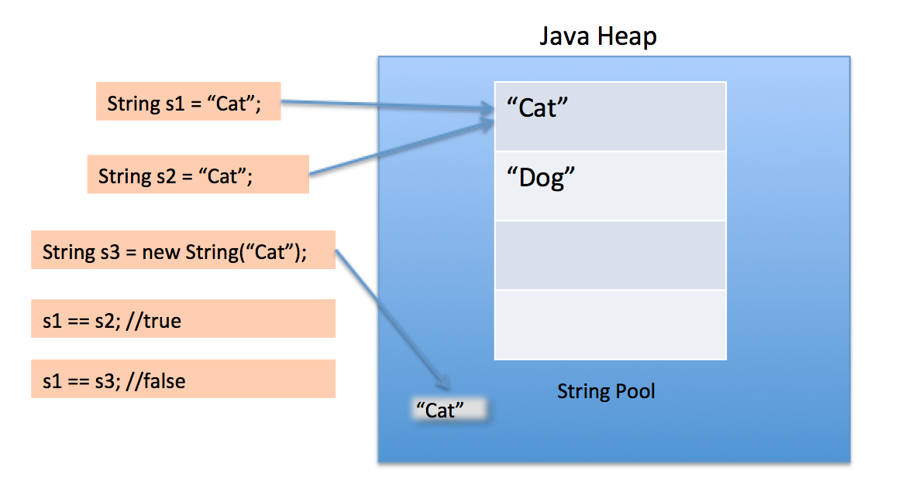

똑같은 기능을 수행하는 객체는 매번 생성하기 보다는 객체 하나를 재사용하는 편이 더 나은 상황이 많다. 특히 불변 객체는 언제든지 재사용할 수 있다.

```java
String s = new String("word"); // 1
String s = "word"; // 2
```

1번 문장은 실행될 때 마다 String 인스턴스를 새로 생성한다. 반면 2번 문장은 새로운 인스턴스를 매번 만드는 대신 하나의 String 인스턴스를 사용한다. 또한 같은 가상 머신 안에서 이와 똑같은 문자열 리터럴을 사용하는 모든 코드가 같은 객체를 재사용함이 보장된다.

---
❓ String 생성

String을 생성하는 대에는 2가지 방법이 있다. 위의 1번 방법과 2번 방법이 존재한다. 그렇다면 두 방법의 차이는 무엇일까?

자바에서는 **String Constant Pool**이 존재한다. String literal로 생성하면 해당 String 값은 Heap 영역 내 **String Constant Pool**에 저장되어 재사용되지만, new 연산자로 생성하면 같은 내용이라도 여러 개의 객체가 각각 Heap 영역을 차지한다.



출처 : https://starkying.tistory.com/entry/what-is-java-string-pool

---

이와 유사하게 `Boolean(String)` 대신 `Boolean.valueOf(String)` 팩터리 메서드를 사용하는 것이 좋다. `Boolean.valueOf(String)` 은 Boolean 객체가 가지고 있는 필드를 반환하는데, 만약 true를 반환하는 상황이라면 `public static final Boolean *TRUE* = new Boolean(true)` 를 반환한다. 생성자는 호출할 때마다 새로운 객체를 만들지만, 팩터리 메서드는 전혀 그렇지 않다. 불변객체 뿐만 아니라 가변 객체라도 사용중에 변경되지 않을 것임이 확실하다면 재사용할 수 있다.

생성 비용이 비싼 객체가 반복해서 필요하다면 캐싱해서 재사용하자. 다음은 주어진 문자열이 유효한 로마 숫지인지를 확인하는 메서드이다.

```java
static boolean isRomanNumeral(String s) {
    return s.matches("^(?+."); // 생략
```

위 방식에서는 `String.matches()` 는 성능이 중요한 상황에서 반복해 사용하기에는 적합하지 않다. 메서드 내부의 `Pattern` 인스턴스는 한번 쓰고 버려져서 곧바로 가비지 컬렉션 대상이 된다.

성능을 개선하기 위해 Pattern 인스턴스를 클래스 초기화 과정에서 직접 생성해 캐싱해두고, 나중에 `isRomanNumeral` 메서드가 호출될 때 마다 이 인스턴스를 재사용한다.

```java
public class RomanNumberals {
    private static final Pattern ROMAN = Pattern.compile("^(?+.");
    
    static boolean isRomanNumeral(String s) {
        return ROMAN.matcher(s).matches();
    }
}
```

이렇게하면 성능 뿐만아니라 이전에 존재조차 몰랐던 Pattern 인스턴스를 static final 필드로 끄집어내고 이름을 지어주어 코드의 의미도 훨씬 자연스럽게 드러난다. 하지만 isRomanNumeral 메서드가 호출되지 않는다면, ROMAN 필드는 필요없이 초기화된 상황이다. 그렇다고 지연 초기화를 통해 불필요한 초기화를 없앨 필요는 없다.

오토 박싱은 불필요한 객체를 만들어낸다. 오토박싱은 기본 타입과 그에 대응하는 박싱된 기본 타입의 구분을 흐려주지만, 완전히 없애주는 것은 아니다.

```java
private static long sum() {
    Long sum = 0L;
    for (long i = 0; i <= Integer.MAX_VALUE; i++) {
        sum += i;
    }
    return sum;
}
```

위 메서드는 정확한 답을 반환한다. 하지만 문제점이 있다. 위 코드에서는 sum 변수를 long이 아닌 Long으로 선언해서 long 타입인 i가 sum에 더해질 때 마다 불필요한 Long 인스턴스가 약 $2^{31}$개가 만들어진다.  단순히 sum의 타입을 long으로만 바꿔주면 훨씬 빠르게 동작한다. 결국 **박싱된 기본 타입보다는 기본 타입을 사용하고, 의도치 않은 오토박싱이 숨어들지 않도록 주의해야 한다.**

하지만 위 내용들이 ‘객체 생성은 비싸니 피하라’는 결론은 아니다. 프로그램의 명확성, 간결성, 기능을 위해서 객체를 추가로 생성하는 것이라면 일반적으로 좋은 일이다.

추가적으로 아주 무거운 객체가 아니라면 객체 풀(pool)을 만들지 않는 것이 낫다. 데이터베이스 연결의 경우, 생성 비용이 워낙 비싸니 재사용하는 편이 낫다.
