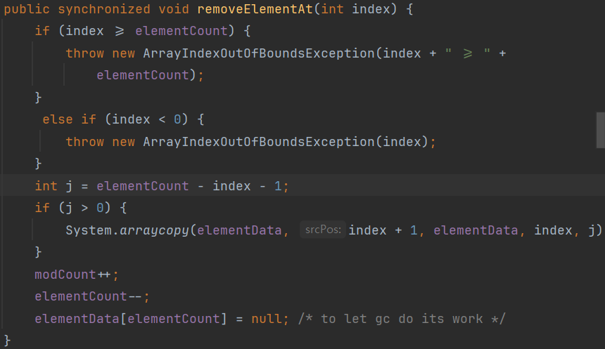

# [ITEM 7] 다 쓴 객체 참조를 해제하라

C, C++은 메모리를 직접 관리하는 것과 다르게 Java는 가비지 컬렉터가 다 쓴 객체를 알아서 메모리 회수해간다. 그렇다고 메모리 관리에 아예 신경을 쓰지 않아도 되는 것은 아니다.

```java
public class Stack {
    private Object[] elements;
    private int size = 0;
    private static final int DEFAULT_INITIAL_CAPACITY = 16;
    
    public Stack() {
        elements = new Object[DEFAULT_INITIAL_CAPACITY];
    }
    
    public void push(Object o) {
        ensureCapacity();
        elements[size++] = o;
    }
    
    public Object pop() {
        if (size == 0)
            throw new EmptyStackException();
        return elements[--size];
    }
    
    private void ensureCapacity() {
        if (elements.length == size) {
            elements = Arrays.copyOf(elements, 2 * size + 1);
        }
    }
}
```

위 코드를 테스트했을 때에는 큰 문제는 없다. 하지만 **메모리 누수**가 발생한다.

위 코드에서 스택이 커졌다가 줄어들 때 스택에서 꺼내진 객체들을 가비지 컬렉터가 회수하지 않는다. 스택이 그 객체들의 참조를 여전히 가지고 있기 때문이다.

예를 들어 스택을 10까지 `push`를 통해서 채웠다가, 5까지 `pop`을 통해 줄였다고 해보자. 개발자 입장에서는 5뒤의 객체는 사용하지 않는다. 하지만 가비지 컬렉터 입장에서는 이 객체들을 회수하지 못한다.

가비지 컬렉션 언어에서는 메모리 누수를 찾기가 어렵다. **객체 참조 하나를 살려두면 가비지 컬렉터는 그 객체뿐만 아니라 객체가 참조하는 모든 객체를 회수하지 못한다.** 그래서 단 몇개의 객체가 매우 많은 객체를 회수되지 못하게 할 수 있고 잠재적으로 성능에 악영향을 준다.

위 문제의 해법은 해당 참조를 다 썼을 때 null 처리를 해주는 것이다.

```java
public Object pop() {
    if (size == 0)
        throw new EmptyStackException();
    Object result = elements[--size];
    elements[size] = null;
    return result;
}
```

null 처리를 통해 가비지 컬렉터가 회수할 수 있도록 할 수도 있지만, **다 쓴 참조를 해제하는 가장 좋은 방법은 그 참조를 담은 변수를 유효 범위 밖으로 밀어내는 것이다.**


> ❓ 유효 범위?
> 
> 위 내용에서 ‘그 참조를 담은 변수를 유효 범위 밖으로 밀어내는 것’라는 말은 변수를 지역변수로 선언하면 해당 범위를 벗어났을 때 자연스럽게 가비지 컬렉션의 대상이 된다.


# 메모리 누수 대상

## 자기 메모리를 직접 관리하는 경우

null 처리의 대상은 **자기 메모리를 직접 관리하는 경우**가 된다. 스택은 elements 배열로 저장소 풀을 만들어 원소들을 관리한다. 가비지 컬렉터는 배열에서 범위에 해당하는 객체를 알 길이 없다. 모두 똑같은 객체이므로 null 처리를 통해 가비지 컬렉터에게 알린다.

---
> ❓ 배열의 크기를 계속 늘렸다면?
>
> Stack에서 많은 push()로 인해 배열이 계속 확장이 됐고
이후 대부분의 객체를 참조 해제 했을 때
이미 확장된 배열의 크기가 메모리에 영향을 주는 부분이 있나요?
해제 과정에서 배열의 크기를 줄이고 새로 복사해서 내보내지 않을까 생각을 해보긴 했는데,
영향이 있다면 영향을 줄이는 방법이랑 있어도 굳이 할 필요가 없는지 같은 내용이 궁금합니다!
>
>
> 해당 내용이 참조 해제와 관련이 있으면 관련 내용도 알고 싶습니다!
>

배열의 크기가 확장된 상태라면, 배열의 크기에 따라 갖게되는 참조변수는 결국 존재하기 때문에, 객체 자체의 메모리는 GC에 의해 수거되지만 단순한 참조변수는 사라지지 않는 것 같습니다.
실제로 Stack 구현체의 코드를 살펴본 결과 다음과 같습니다. Stack 구현체는 Vector 클래스를 상속받고 있기 때문에 실제로 `pop()`메서드 실행시 아래 메서드가 실행됩니다.



스택의 경우, j는 0이 되기 때문에 단순히 배열의 해당 참조를 null로 바꿔주기만 하고 있는 것 같습니다. Vector 클래스 내에 원소의 개수만큼 배열의 사이즈를 조정하는 `trimToSize()`메서드가 존재하기는 합니다. 그런데 Stack의 `pop()`메서드 내에서 따로 실행을 시키지는 않고 있습니다.
단순히 제 생각으로 짐작해본 결과.. 저장되는 객체에 비해 배열의 참조변수는 메모리 사용량이 비교적 적기도하고, pop 실행 시 마다 사이즈를 재조정하기에는 오버헤드가 더 크기 때문이 아닐까 싶습니다.
---

## 캐시

캐시 역시 메모리 누수를 일으키는 주범이다. 객체 참조를 캐시에 넣고 객체를 사용한 뒤로도 한참을 냅둔다면 메모리 누수가 발생한다.

- Key 값을 참조하는 동안만 엔트리가 살아 있는 캐시가 필요한 상황 ⇒ WeakHashMap
    - 다 쓴 엔트리는 그 즉시 자동으로 제거

```java
import java.util.HashMap;
import java.util.WeakHashMap;

public class Test {
    public static void main(String[] args) {
        WeakHashMap<Key, String> weakHashMap = new WeakHashMap<>();
        Key key1 = new Key("key1");
        Key key2 = new Key("key2");
    
        weakHashMap.put(key1, "1");
        weakHashMap.put(key2, "2");
    
        key2 = null;
    
        while (true) {
            System.out.println(weakHashMap);
            System.gc();
            if (weakHashMap.size() == 1) {
                break;
            }
        }
        System.out.println("WeakHashMap End");
    
        HashMap<Key, String> hashMap = new HashMap<>();
        Key key3 = new Key("key3");
        Key key4 = new Key("key4");
    
        hashMap.put(key3, "3");
        hashMap.put(key4, "4");
    
        key4 = null;
        for (int i = 0; i < 2; i++) {
            System.out.println(hashMap);
            System.gc();
        }
    
        System.out.println("HashMap End");
    }

    static class Key {
        String key;
    
        public Key(String key) {
            this.key = key;
        }
    
        @Override
        public String toString() {
            return key;
        }
    }
}

```

위 코드의 출력은 다음과 같다.

```java
{key2=2, key1=1}
{key1=1}
WeakHashMap End
{key4=4, key3=3}
{key4=4, key3=3}
HashMap End
```

실제로 WeakHashMap은 key값이 null로 변경되면 엔트리도 사라진다. 반대로 HashMap은 key값이 null로 변경되더라도 그대로 존재한다.

캐시를 만들 때 캐시 엔트리의 유효기간을 정확히 정의 하기 어렵다. 따라서 시간이 지날수록 가치를 떨어뜨리는 방식을 흔히 사용한다. 이런 방식에서는 엔트리를 이따금 청소해야 한다. 백그라운드 스레드를 활용하거나 캐시에 새 엔트리를 추가할 때 부수 작업으로 수행하는 방법이 있다.

- LinkedHashMap
    - removeEldestEntry 메서드 사용 ⇒ 엔트리가 추가될 때마다 수행 (가장 오래된 엔트리를 제거할지 결정)

## 리스너(listener) or 콜백(callback)

클라이언트가 콜백을 등록만 하고 명확히 해지하지 않는다면, 조치해주지 않는 한 콜백은 계속 쌓여갈 것이다. 이럴 때 콜백을 약한 참조로 저장하면 가비지 컬렉터가 즉시 수거해간다. 예를 들어 WeakHashMap에 키로 저장하면 된다.

---
❓ 콜백?

- 하나의 객체를 다른 객체의 메서드의 매개변수로 넘겨주는 실행 가능한 코드
- 이 때 파라미터로 전달되지만 값을 넘겨주는 게 아닌 특정 로직을 담은 일종의 함수를 넘겨서 실행시키기 위해 사용

```java
interface Callback {
    int execute(final int n);
}

class Template {
    int workflow(Callback cb) {
        int num = 100;
        int result = cb.execute(num);
        return result;
    }
}

public class Client {
    public static void main(String[] args) {
        int x = 100;
        int y = 20;
        
        Template t = new Template();
        int result = t.workflow(new Callback() {
            @Override
            public int execute(final int n) {
                    return n * n;
            }
        });
        System.out.println(result);
    }
}
```
출처 : [https://inpa.tistory.com/entry/GOF-💠-Template-Callback-변형-패턴-알아보기](https://inpa.tistory.com/entry/GOF-%F0%9F%92%A0-Template-Callback-%EB%B3%80%ED%98%95-%ED%8C%A8%ED%84%B4-%EC%95%8C%EC%95%84%EB%B3%B4%EA%B8%B0)

---
**Git Issue**

> ❓ 객체 참조 null 처리해야 하는 경우들
>
> 38p ' 객체 참조를 null 처리해야 하는 일은 예외적인 경우여야 한다'
>
> 1. 예외적인 경우가 추가적으로 어떤 것들이 있는지
> 2. Stack 외에도 자기 메모리를 직접 관리하는 클래스의 종류
> 3. 유효 범위 밖으로 밀어낸다는 것이 어떻게 동작 시킨다는 것인지
> 4. 콜백의 해지 예시와 해지 시 주의해야 할 점이 있다면 어떤 것인지
>
> 이렇게 이해 안되는 부분들이 있는데 알려주실 수 있을까용
>
1. 책에서 말하는 예외적인 경우는 Stack처럼 메모리를 직접 관리하는 경우라고 생각합니다.
2. 스택 외에도 큐나 아니면 객체 풀 같은 경우가 있을 것 같습니다
3. 저는 이 문장을 읽을 때 객체의 범위를 바꾸는 것인가 했는데, 책에서 ITEM 57을 살짝 살펴보았을 때, 객체의 범위를  최소화하라는 뜻으로 느껴집니다!
4. 콜백 해지 예시 (필드에 콜백 할당)

예시 코드가 길어서 자세한 내용은 레포에 푸시해서 올리겠습니다! 간단하게 테스트 코드만 살펴보겠습니다. `DatabaseManager` 는 콜백 인터페이스인 `Connection` 을 필드로 가지고 있습니다. `Connection` 인터페이스는 클라이언트 측엥서 정의되고 `CustomDatabaseManager` 에 할당됩니다.

```java
@DisplayName("콜백으로 정의된 인터페이스를 필드에 직접 가지고 있으면 메모리누수")
@Test
public void memoryLeak() {

    Connection connection = createConnection("Memory Leak Connection");

    DatabaseManager databaseManager = new CustomDatabaseManager(connection);
    databaseManager.execute("SELECT * FROM TEST");

    connection = null; // 참조해제 시도

    System.gc();
    System.runFinalization();
    
    Thread.sleep(3000);

    assertNotNull(((CustomDatabaseManager) databaseManager).getConnection());
}
```

단순하게 클라이언트에서 `connection` 에 null을 할당할 수 있습니다. 그 뒤 GC가 수거하길 기다리지만 수거하지 않습니다. 즉, `databaseManager`의 `connection`은 다시 사용되지 않아도 gc의 대상이 되지 않습니다. 이 경우 메모리 누수를 방지하는 방법은 `databaseManager`에게 직접 `connection`에 null을 할당하라고 명령하는 것입니다.

```java
@DisplayName("필드에 참조된 콜백 인터페이스를 참조해제 하는 방법")
@Test
public void callbackMemory() {
    Connection connection = createConnection("Memory Leak Connection");
    DatabaseManager databaseManager = new CustomDatabaseManager(connection);

    ((CustomDatabaseManager) databaseManager).deConnect();
    connection = null;

    assertNull(((CustomDatabaseManager) databaseManager).getConnection());
}

```

다른 방식으로 콜백을 등록할 수 있는데 `WeakHashMap` 을 사용하는 것입니다.

```java
@DisplayName("WeakHashMap 을 사용해서 메모리 누수 방지하는 방법")
@Test
public void weakHashMap() throws InterruptedException {
    Connection connection = createConnection("using WeakHashMap");
    DatabaseManager databaseManager = new CacheDatabaseManager(connection);

    connection = null; // 참조해제 시도

    System.gc();
    System.runFinalization();

    Thread.sleep(3000);

    assertThrows(RuntimeException.class, ((CacheDatabaseManager) databaseManager)::getConnection);
}
```

`WeakHashMap` 을 사용할 경우 클라이언트에서 null을 할당해도 gc의 대상이 될 수 있습니다.

주의할 점은 첫번째 예시와 같이 사용할 경우 직접 해당 객체에서 null로 변경해야 한다는 점이 될 수 있습니다.

---

## 참조 유형

Java에는 네 가지 참조 유형이 있다.

### Strong Reference (강한 참조)

```java
MyClass mc = new MyClass();
mc = null; // GC의 대상으로 변경
```

Java의 기본적인 참조 유형이다. mc 변수가 참조를 가지고 있는 한, MyClass 객체는 가비지 컬렉션의 대상이 되지 않는다.

### Soft Reference (소프트 참조)

```java
MyClass mc = new MyClass();
SoftReference<MyClass> softMc = new SoftReference<MyClass>(mc);

// GC의 대상으로 변경
mc = null;

// JVM 메모리가 부족하지 않아 GC의 대상이 되지 않는 경우
// null이 아닌 기존 객체 반환
mc = softMc.get();
```

대상 객체를 참조하는 경우가 SoftReference 객체만 존재하는 경우 가비지 컬렉션의 대상이 된다. **단, JVM 메모리가 부족한 경우에만 힙 영역에서 제거되고 메모리가 부족하지 않다면 굳이 제거하지 않는다.**

### Weak Reference (약한 참조)

```java
MyClass mc = new MyClass();
WeakReference<MyClass> weakMc = new WeakReference<MyClass>(mc);

mc = null;

// 다음 GC 실행 시 무조건 힙 영역에서 제거
mc = weakMc.get();
```

대상 객체를 참조하는 경우가 WeakRefernce 객체만 존재하는 경우 가비지 컬렉션의 대상이 된다. 다음 가비지 컬렉션 실행 시 무조건 힙 영역에서 제거된다.

### Phantom Reference (팬텀 참조)

Phantom Reference는 생성시 필수적으로 ReferenceQueue가 필요하다. PhantomReference의 참조값을 수동으로 clear() 메서드를 실행해야하고, PhantomReference.get() 메서드는 항상 null을 반환한다.

Phantom Reference는 주로 객체가 메모리에서 제거되기 전에 수행해야 하는 특별한 종료 작업을 처리하는데 사용된다. 실제로 팬텀 참조는 잘 사용하지 않는다.

---

참조

https://inpa.tistory.com/entry/GOF-💠-Template-Callback-변형-패턴-알아보기

https://lion-king.tistory.com/entry/Java-참조-유형-Strong-Reference-Soft-Reference-Weak-Reference-Phantom-References
